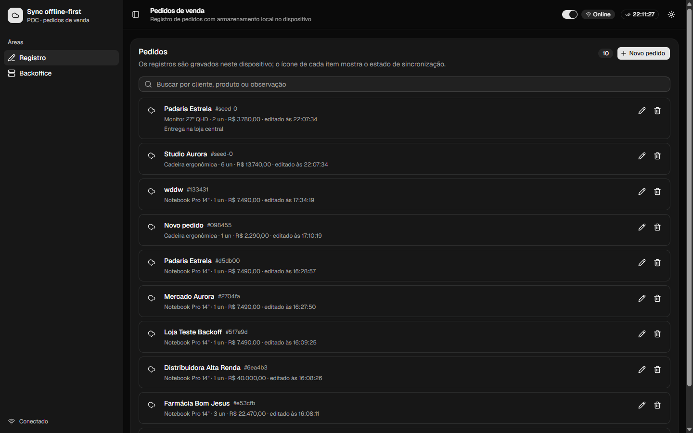
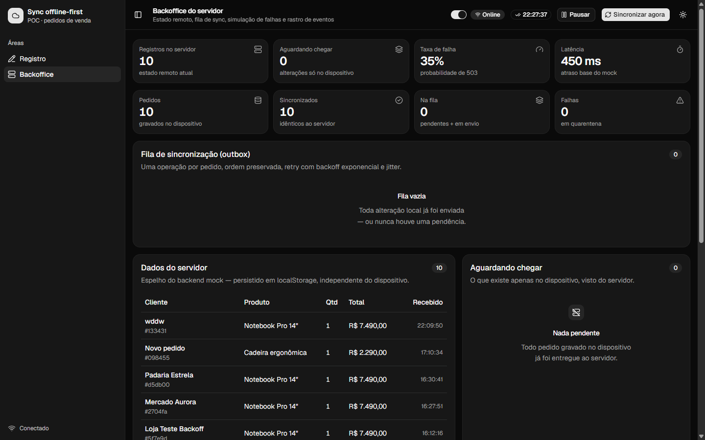
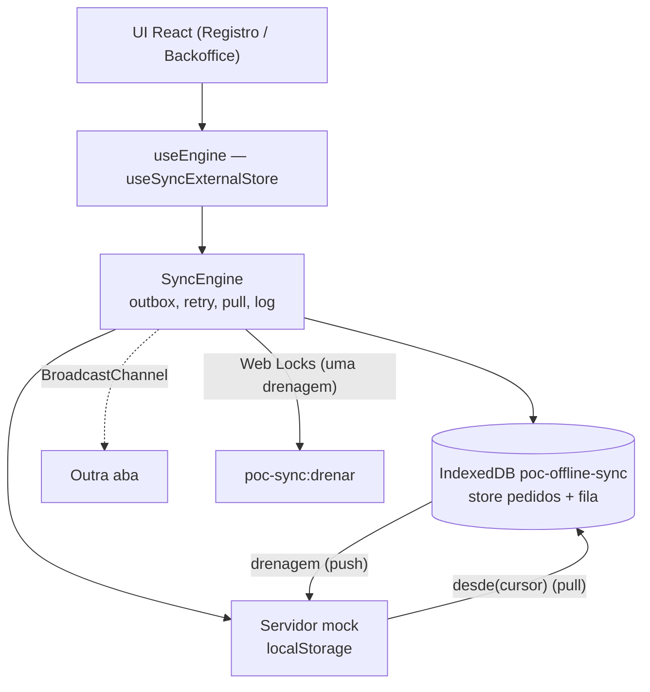

# POC — Fila de sincronização offline-first

Prova de conceito de um app de **registro de pedidos de venda** que funciona sem
rede: tudo é gravado no dispositivo, enfileirado na outbox e sincronizado com o
servidor quando a conexão volta — com retry/backoff, conflito, idempotência,
multi-aba e PWA instalável.

<p align="center">
  
  <br><br>
  
</p>

<!-- Badges (ativar quando houver remoto):
[](https://github.com/<owner>/<repo>/actions/workflows/ci.yml)
-->

## Índice

- [Funcionalidades](#funcionalidades)
- [Começando](#começando)
- [Arquitetura](#arquitetura)
- [Fluxo de sincronização](#fluxo-de-sincronização)
- [Protocolo cliente ↔ servidor](#protocolo-cliente--servidor)
- [Multi-aba e concorrência](#multi-aba-e-concorrência)
- [PWA e modo offline](#pwa-e-modo-offline)
- [Estrutura do projeto](#estrutura-do-projeto)
- [Testes](#testes)
- [Gitflow](#gitflow)
- [Licença](#licença)

## Funcionalidades

- **Registro** (app normal): criar/editar/excluir pedidos, busca na lista e
  ícone de estado por item (`CloudCheck` no servidor, `CloudUpload` na fila,
  `TriangleAlert` em falha).
- **Backoffice** (tudo de sync): espelho do servidor, outbox, simulação de
  rede/falhas, log de eventos e manutenção.
- **Outbox em IndexedDB** com coalescência — uma única operação por pedido,
  ordem preservada (`seq`), `chave` de idempotência renovada a cada mutação.
- **Retry** com backoff exponencial + jitter (base 1s, teto 30s, 6 tentativas);
  erros `422` vão direto para quarentena.
- **Pull bidirecional** com cursor e tombstones (remoções propagadas).
- **Conflito `409`**: o device adota a versão do servidor, descarta a operação
  e contabiliza o conflito.
- **Idempotência**: replay da mesma `chave` no servidor devolve o mesmo registro.
- **Multi-aba**: `BroadcastChannel` para propagar mudanças + `navigator.locks`
  para garantir uma única drenagem por vez.
- **Simulação**: switch Online/Offline, taxa de falha, latência, pausar fila,
  reiniciar servidor, limpar dispositivo.
- **PWA**: manifest instalável + service worker (registrado só em produção).
- **UI**: tema claro/escuro, busca, badge de última sincronização, layout
  responsivo (tabelas viram lista de cards no mobile).

## Começando

Requisitos: Node 24+ e npm 11+.

```bash
npm install
npm run dev      # http://localhost:5173
```

### Scripts

| Script                 | O que faz                                                   |
| ---------------------- | ----------------------------------------------------------- |
| `npm run dev`          | servidor de desenvolvimento com HMR                         |
| `npm run build`        | `tsc -b` (typecheck) + bundle de produção                   |
| `npm run preview`      | serve o `dist/` — aqui o service worker é registrado        |
| `npm run lint`         | oxlint (0 erros; 5 avisos conhecidos em arquivos shadcn)    |
| `npm test`             | Vitest (jsdom + fake-indexeddb)                             |
| `npm run test:watch`   | Vitest em watch mode                                        |
| `npm run format`       | Prettier escreve a formatação padrão                        |
| `npm run format:check` | Prettier verifica (roda no CI)                              |
| `npm run typecheck`    | só o `tsc -b`                                               |
| `npm run verify`       | lint + format:check + test + build (rode antes de commitar) |

> O service worker só é registrado com `import.meta.env.PROD`; a experiência
> offline end-to-end aparece em `npm run preview`, não no `dev`.

## Arquitetura



- `src/lib/engine.ts` — núcleo: fila, coalescência, backoff, pull, conflito,
  log, snapshot para o React.
- `src/lib/mock-server.ts` — backend simulado: `put`/`remove` idempotentes,
  `409`/`422`/`503`, tombstones e `desde(cursor)`.
- `src/lib/idb.ts` — helpers de IndexedDB (`listar`/`salvar`/`remover`/`limpar`).
- `src/lib/types.ts` — contratos compartilhados (`Pedido`, `Operacao`,
  `RegistroServidor`, `Snapshot`).

## Fluxo de sincronização

1. A UI grava no IndexedDB **e** na outbox — nunca fala com o servidor direto.
2. A outbox mantém **uma operação por pedido**: edições repetidas coalescem
   (`rev` e `chave` são renovados a cada mutação).
3. `drenar()` envia na ordem da fila com latência simulada; sucesso remove a
   operação e grava a `serverRev` do registro no device.
4. Depois de um push (e no `init`/reconexão) roda o **pull**:
   `server.desde(cursor)` aplica registros alterados e tombstones.
5. Falha transitória → backoff + jitter; falha permanente (`422`) → quarentena
   na UI; `409` → adota a versão do servidor.

## Protocolo cliente ↔ servidor

| Situação                                       | Resposta          | Comportamento do engine                                  |
| ---------------------------------------------- | ----------------- | -------------------------------------------------------- |
| Envio ok                                       | `200` + `rev + 1` | remove da fila, grava `serverRev`                        |
| Replay da mesma `chave`                        | mesmo registro    | idempotente: nada muda                                   |
| `total > R$ 50.000`                            | `422` permanente  | vai direto para quarentena (`failed`)                    |
| Instabilidade                                  | `503` transitória | backoff + jitter até esgotar 6 tentativas                |
| Device com `rev` menor e `atualizadoEm` antigo | `409` + registro  | device adota o servidor, descarta a op, conta o conflito |
| Device apaga                                   | tombstone         | pull propaga a remoção para as demais abas/devices       |

Backoff: `espera = exp/2 + rand(0, exp/2)` com
`exp = min(base * 2^(tentativa-1), teto)` — evita thundering herd.

## Multi-aba e concorrência

- **`BroadcastChannel('poc-sync:canal')`**: quando uma aba termina de drenar,
  as outras rereem IndexedDB e o servidor.
- **`navigator.locks('poc-sync:drenar', { ifAvailable })`**: só uma aba drena
  por vez; quem não pega a trava cede.
- **Operação interrompida**: `syncing` gravado no IndexedDB significa reload no
  meio do envio — no próximo `init` volta para `pending`.
- **Prefs de simulação** ficam em `poc-sync:sim`; `online` usa
  `navigator.onLine` + listeners (o switch do header sobrepõe).

## PWA e modo offline

- `public/manifest.webmanifest` + `theme-color` no `index.html` (instalável).
- `public/sw.js`: network-first para navegação (fallback do cache) e
  cache-first para assets same-origin `GET`.
- Registro em `src/main.tsx`, apenas quando `import.meta.env.PROD`.

## Estrutura do projeto

```
src/
├─ components/        # app-header, app-sidebar, pedidos-panel, fila-sync,
│  └─ ui/             # componentes shadcn (não editar manualmente)
├─ hooks/             # use-engine (subscribe/getSnapshot)
├─ lib/
│  ├─ engine.ts       # SyncEngine: outbox, backoff, pull, conflito, log
│  ├─ mock-server.ts  # backend simulado (localStorage)
│  ├─ idb.ts          # helpers de IndexedDB
│  ├─ types.ts        # contratos
│  └─ backoff.ts      # backoff + formatadores
├─ views/             # registro-view, backoffice-view
└─ test/              # setup do Vitest (fake-indexeddb)
docs/screenshots/     # imagens do README
.github/workflows/    # CI (lint, format, test, build)
```

## Testes

```bash
npm test
```

20 testes em 3 arquivos:

- `backoff.test.ts` — limites do backoff e formatadores.
- `mock-server.test.ts` — idempotência, `409`, `422`, tombstones, `desde(cursor)`.
- `engine.test.ts` — outbox offline, coalescência, descarte de create não
  enviado, push ao voltar online, quarentena, conflito, pull e tombstone.

Padrão: cada teste cria uma `SyncEngine` nova com `taxaFalha: 0` e
`latenciaMs: 0`, espera com `vi.waitFor` e encerra com `engine.parar()` (fecha
timers/canal). O `beforeEach` limpa `localStorage` e as duas stores do IndexedDB.

## Gitflow

- **`main`** — apenas releases estáveis (commits verdes no CI). Sempre via
  merge `--no-ff` a partir de `develop`.
- **`develop`** — integração: é onde o trabalho acontece.
- **`feat/*`, `fix/*`, `chore/*`, `docs/*`** — ramificam de `develop` e voltam
  para ela.
- **Commits**: [Conventional Commits](https://www.conventionalcommits.org/)
  em pt-BR (`feat:`, `fix:`, `chore:`, `docs:`, `test:`).
- Hooks (husky + lint-staged) rodam Prettier e oxlint nos arquivos staged;
  `npm run verify` antes de cada merge em `develop`.
- Com remoto configurado, os merges passam a ser feitos por Pull Request
  (CI roda em `main` e `develop`).

## Limitações conhecidas (é uma POC)

- Servidor é `localStorage` no mesmo navegador — não há rede real nem backend.
- Conflito resolve automático (device adota o servidor); não há UI de escolha.
- Sem autenticação, paginação nem migração de esquema.
- Cursor de pull é monotônico por dispositivo (sem re-sync completo).

## Licença

MIT — veja [LICENSE](LICENSE).
